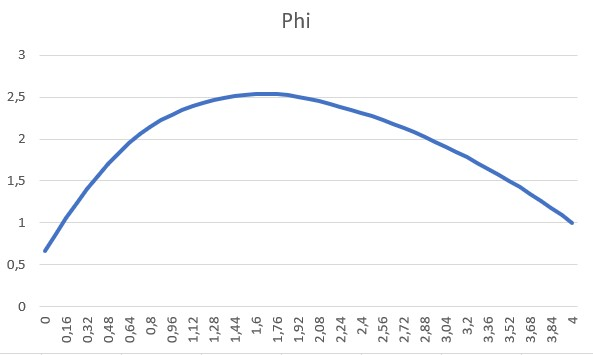

# Electromagnetic Potential Solver (Finite Element Method)

This project was developed as part of the **Differential and Difference Equations** course. It implements the **Finite Element Method (FEM)** to solve a 1D boundary value problem (BVP) representing electromagnetic potential.

## 1. Problem Definition
The project solves the following second-order differential equation:
$$\frac{d^2\phi}{dx^2} = -\frac{\rho}{\epsilon_r}$$

### Boundary Conditions:
* **Robin Condition** (at $x=0$): $\phi'(0) - \phi(0) = 2$
* **Dirichlet Condition** (at $x=4$): $\phi(4) = 1$

### Parameters:
* Charge density ($\rho$): $2$
* Relative permittivity ($\epsilon_r$): A piecewise constant function defined over the intervals $[0,1]$, $[1,2]$, and $(2,4]$.

## 2. Methodology
The solution follows a standard FEM pipeline:
1.  **Variational Formulation**: Deriving the weak form $b(w, v) = l(v)$ using integration by parts.
2.  **Discretization**: Using $n$ elements with linear basis functions (hat functions).
3.  **Numerical Integration**: 2-point **Gauss-Legendre quadrature** is used to calculate the stiffness matrix and load vector.
4.  **System Solver**: The resulting tri-diagonal system of linear equations is solved efficiently using the **Thomas Algorithm**.

## 3. Implementation
The solver is written in **C++**. 
* **Input**: The user provides the number of elements ($n$) as a runtime parameter.
* **Output**: The program generates a `.csv` file containing the calculated potential values $\Phi(x)$ for visualization.

## 4. Results
Visual representation of the electromagnetic potential for $n = 50$:



## 5. How to Run
1.  Compile the source code:
    ```bash
    g++ src/main.cpp -o fem_solver
    ```
2.  Run the executable:
    ```bash
    ./fem_solver
    ```
3.  Enter the number of elements when prompted.
